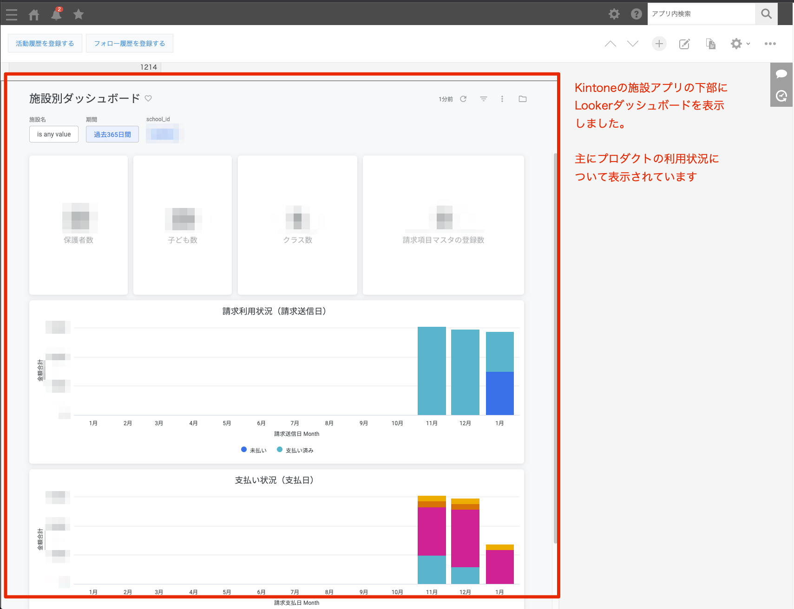
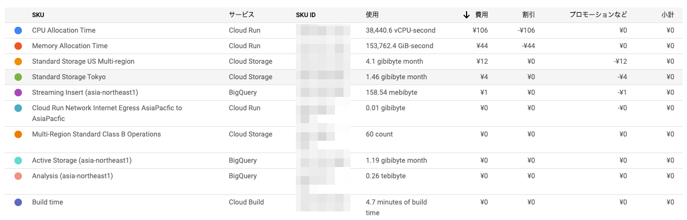

# 小さく始めるデータ基盤
@reizist

---

# 自己紹介


@reizist
Web Backend / Infra / Data (Infra)
Rなんとかという会社で
データエンジニア
最近CloudComposer2と戯れています

---

# 背景
* データ基盤はもはや大規模サービスにのみ必要なものではない
* スタートアップでもデータ基盤の需要は増えてきている
* 今回 副業で [enpay.Inc](https://enpay.co.jp/) で構築した事例を紹介します

---

# 事前制約

* 外部にダッシュボードを埋め込みで提供したい
    - [Looker](https://docs.looker.com/ja/sharing-and-publishing/publishing-looks-with-public-urls)を採用したい

---

# 重要視した方針
* 汎用化
   * エンハンス/リプレイスしやすい技術を採用
* 作り込まない
    - Airflow, Argo Workflow等ワークフローエンジンの採用を見送る
* リスク最小化
   * DWHには個人情報を一切入れない[「全部なし戦略」](https://tech.nri-net.com/entry/2021/05/31/135035)

---


# どんなデータを集める？
1. クライアントログ
2. DB
3. 各SaaS(kintone)

---


# どこにデータを集める？
* BigQuery
    * エコシステムが整って枯れているBigQueryに不満がなかった
    * 権限周り/cli周りの取り回し
* Snowflakeのtrialしてみたいと思いつつ..
---

# Q. どうやってデータを集める？

* 真っ先にtroccoをtrialで導入し検討した
    - [あらゆるデータソース](https://trocco.io/lp/service.html)に対応していて要件(DB, SaaSからのデータ取り込み)は満たせた
* が要件に対してはコストが見合わなかったので断念
* Embulk on CloudRunを採用
    - コンテナベースなので安心


---
<!-- _class: lead -->


---

# DB
* Aurora instanceから個人情報をすべてマスク済のsnapshotを作成
* snapshotからS3にParquetでexport
    - **S3にDBのデータがリスクのない状態で配置**
* CloudRun上で実行されるbq loadによりS3のParquetをBQにimport

--- 

# SaaS
* **Embulk on CloudRun**
* CloudRunのroot endpointにアクセスすると実装済のすべてのembulk configをsequentialにembulk runする
    - 環境変数によって個別に実行可能
* SaaS毎のendpointを作る等自由に拡張可能

---

# ClientLog
* **Google Analytics**
* 必要な箇所で `trackEvent` を呼ぶだけでBQにほぼリアルタイムにロギングされる

```
export const EventTracker = {
  trackEvent: function (event_name: string, payload: any) {
    try {
      gtag('event', event_name, payload)
    } catch (error) {
        ...
    }
  },
}
```

---

# どうやって使っている？
* まずはsales/csメンバー向けのkintoneダッシュボード上でLookerダッシュボードを埋め込み表示
* 今後エンドユーザーに便利ダッシュボードを公開予定

---

<!-- _class: lead -->


---

# 稼働状況
* StepFunction, CloudRun共に
daily jobは実装完了後一度も落ちていない

---


# ランニングコスト
* 実質無料
    - CloudRun & BQ (& CloudBuild)で200円くらい
    - CloudRun最高！




---

<!-- _class: lead -->
enpayのプロダクト/データに興味がある方は[こちら](https://meety.net/matches/KtzxgTxsfhZp)へどうぞ！
Looker採用決定したCTOがカジュアルにトークします


---


<!-- _class: lead -->
**まずは小さく始めよう**


