# Airflow2にupgradeした事例紹介
@reizist

---

# 自己紹介


@reizist
Web Backend / Infra / Data (Infra)
Rなんとかという会社で
データエンジニア
魚を捌いて食べるのが好きで、海沿いへの移住を検討しています

---

<!-- _class: lead -->

Airflow1.10.15/CloudComposer1を
Airflow2.2.1/CloudComposer2に
upgradeした事例を紹介します

---

<!-- _class: lead -->

Airflowを使っている方 ✋
Airflowを使っているがまだ1系の方 ✋
は参考になるかもしれません


---

# アジェンダ
* Airflow2 upgradeの恩恵/モチベーション
* Airflow2へのupgrade方法
* 補足

---

# Airflow2(Composer2)の恩恵/モチベーション
* Airflow1系のサポート体制への懸念
  - [GCPにおいても2023/3でAirflow1を非サポート化](https://cloud.google.com/composer/docs/concepts/versioning/composer-versioning-overview?hl=ja#version-deprecation-and-support)
  - daily job を落とさず毎日朝11時までに必ずデータを揃えたい都合上安心できるサポート体制が必要

---

# Airflow2(Composer2)の恩恵/モチベーション

* DAGの記述量が減り簡素化できる"TaskFlow API"
  - 後述の理由によりAirflow1と書き方を継続

<div style="font-size: 2rem;float:left; max-width:50%; width:49%;">

* Airflow1

```python
# Operatorの定義が冗長的
extract   = PythonOperator(task_id="extract",   python_callable=extract)
transform = PythonOperator(task_id="transform", python_callable=transform)
load      = PythonOperator(task_id="load",      python_callable=load)

extract >> transform >> load # 依存関係を明示的に定義
```

</div>

<div style="font-size: 2rem;float: right; max-width:50%; width: 49%;">

* Airflow2

```python
order_data = extract()
order_summary = transform(order_data)
load(order_summary["total_order_value"])
```

</div>


---

# Airflow2(Composer2)の恩恵/モチベーション

* TaskGroupが使える
  - グループ化したいTaskをSubDagOperatorで実現していた
  => 稀に想定以上のリソースを要求しworkerが落ちる障害
  - <font color="#c26">非推奨なSubDagOperatorからの脱却</font>


---

# Airflow2(Composer2)の恩恵/モチベーション

* Composer2によるインフラリソース管理の柔軟化
  - Airflow1時はdaily job実行時にnode数を自前スケールしていた
  => <font color="#c26">GKEのAutoPilotによりnode管理が不要に</font>
  - スケジューラのマシンタイプや実行数は指定不可だった
  => <font color="#c26">スケジューラの冗長化が可能になりより堅牢に</font>
  - daily jobは半日しっかり動き半日ほとんど動かない
  => <font color="#c26"> インフラリソースの最適化が見込めた </font>

---

# Airflow2(Composer2)の恩恵/モチベーション
* 総じてdaily jobが動かすtask runnerとしてより安全に/運用コストの削減が見込めた

---

# Airflow2へのupgrade方法

* 基本は[公式Doc](https://airflow.apache.org/docs/apache-airflow/stable/upgrading-from-1-10/index.html)を読んで順に対応すればOK
  - airflow APIが変わっていたりmodule pathが変わっていたりする
* その他細かい変更はあるのでAirflow1/Airflow2の両ソースをパッと見られる環境にしておくと安心

---

# Airflow2へのupgrade方法

* <font color="#c26">事前制約: daily jobは停止できない</font>
  - Airflow2切り替え後不調時のrollback環境が必須
  - Airflow 1系と2系の両環境を用意しDAGのPause/Unpauseを利用

* 検証時に発覚: Airflow2系で[SubDagOperatorが動かない現象が発生](https://github.com/apache/airflow/issues/18398)
=> TaskGroupへの完全移行が必須

---

# Airflow2へのupgrade方法

* Airflow1系はSubDagOperator
Airflow2系はTaskGroupで動かす必要があった
* とはいえ可能な限りソースコードの差分を小さくしたい
  => タスクの依存関係を作るメソッドを切り出し、SubDagでwrapするメソッドとTaskGroupでwrapするメソッドに分離


---

# Airflow2へのupgrade方法


<div style="font-size: 1.2rem">

```python
def _tasks(dag, child_dag_name, args):
    start_task = dummy_operator(task_id="start_task")
    task       = PythonOperator(task_id="main_task",  python_callable=_main)
    end_task   = dummy_operator(task_id="end_task")
    
    start_task >> task >> end_task
```

```python
def build_xxx_dag(parent_dag_name, child_dag_name, args):
    dag_name = "%s.%s" % (parent_dag_name, child_dag_name)
    with DAG(dag_id=dag_name, default_args=args) as dag:
        _tasks(dag, args)

    return dag

def build_xxx_task_group(dag, args):
    with TaskGroup("xxx_tasks") as xxx_tasks:
        _tasks(dag, args)
    return xxx_tasks
```

</font>

---

# Airflow2へのupgrade方法

<div style="font-size: 2rem;float:left; max-width:50%; width:49%;">
* Airflow1系: daily_task_for_v1.py

```python
dag = DAG(dag_id=DAG_NAME, default_args=default_args, schedule_interval="00 15 * * *")
daily_start_task = DummyOperator(task_id="daily_start_task", dag=dag)
daily_end_task   = DummyOperator(task_id="daily_end_task",   dag=dag)

xxx_tasks = SubDagOperator(
    task_id="xxx_tasks",
    subdag=build_xxx_dag(DAG_NAME, "xxx_tasks", default_args),
    default_args=default_args,
    dag=dag,
)

daly_start_task >> xxx_tasks >> daily_end_task
```

</div>

<div style="font-size: 2rem;float:right; max-width:50%; width:49%;">
* Airflow2系: daily_task_for_v2.py

```python
dag = DAG(dag_id=DAG_NAME, default_args=default_args, schedule_interval="00 15 * * *")
daily_start_task = DummyOperator(task_id="daily_start_task", dag=dag)
daily_end_task   = DummyOperator(task_id="daily_end_task",   dag=dag)

with dag:
    xxx_tasks = build_xxx_task_group(dag, default_args)

daly_start_task >> xxx_tasks >> daily_end_task
```

</div>

---

<!-- _class: lead -->


---

# Airflow2へのupgrade方法
* master branchでは `daily_task_for_v1.py`を、
version2 branchでは `daily_task_for_v2.py`を使う
  - `_tasks()` 内をいじらない限りconflictは発生しない

* master branchへのmergeをtriggerに version2 branchへauto merge
  - master branchではAirflow1が、
  version2 branchではAirflow2がそれぞれ最新のソースコードで動く状態を担保


---

# 補足: SubDagOperatorを辞める

* SubDagOperatorに `on_failure_callback` を指定し失敗時にslackでメンションを受け取る運用
=> SubDag内のどのtaskが落ちてもSubDag自体も失敗する挙動
=> TaskGroupにはcallbackは指定できない
=> 全taskにcallbackを指定することで失敗を検知


---

# 補足: Airflow1=>Airflow2へのデータ移行

* [airflow_db backupのための公式script](https://github.com/GoogleCloudPlatform/python-docs-samples/blob/main/composer/tools/composer_db_transfer.md)がある
  - ただしAirflow2.2ではexecution_dateカラムが廃止されるなどのschema変更があるので2.0系を挟む必要がある
  - SubDagを辞める都合上1系データのimportを頑張る必要もないと判断
    - ただし1系のデータはBQにEmbulkでexportしておいた

---

# 補足: CloudComposer2の地味なupdate

* backend dbがMySQLからPostgreSQLに変わっている
  - Airflowの仕組み上のretryとは別にSQL経由でnon successedなtaskをrerunする自前の仕組みを使っているため影響した

<div style="font-size: 1.0rem">

```sql
SELECT unfinished_task.dag_id, task_id, state, operator,
        IF(state = 'queued',
            (TO_SECONDS(NOW()) - TO_SECONDS(COALESCE(end_date, start_date))), --- `TO_SECONDS` はMySQLにのみ組み込み
            (TO_SECONDS(NOW()) - TO_SECONDS(start_date))
        ) AS duration_time,
        unfinished_task.execution_date, start_date
    FROM
    (
        SELECT * FROM task_instance
        WHERE state IN ('running', 'queued', 'shutdown') AND execution_date LIKE '{}%' AND .....
    ) unfinished_task
    LEFT OUTER JOIN
    ...
```

---

# 補足: CloudLoggingのsink errorが発生
* BQのquery実行ログをAudit Logとして残していた
* (おそらくBigQueryOperatorからBigQueryExecuteQueryOperatorに変わったことで)stderrのschemaが変わった
  - gcp_audit_log.stderrテーブルの再作成で対処した


---

<!-- _class: lead -->
**ご清聴ありがとうございました**


